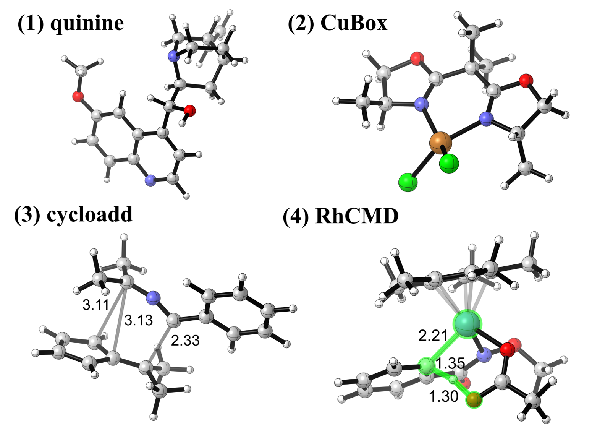
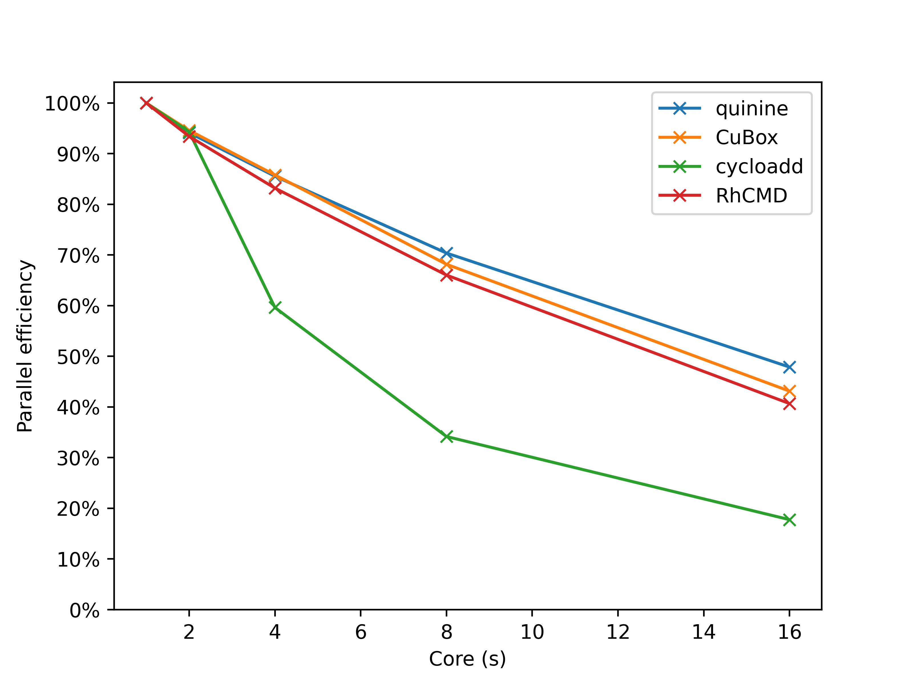
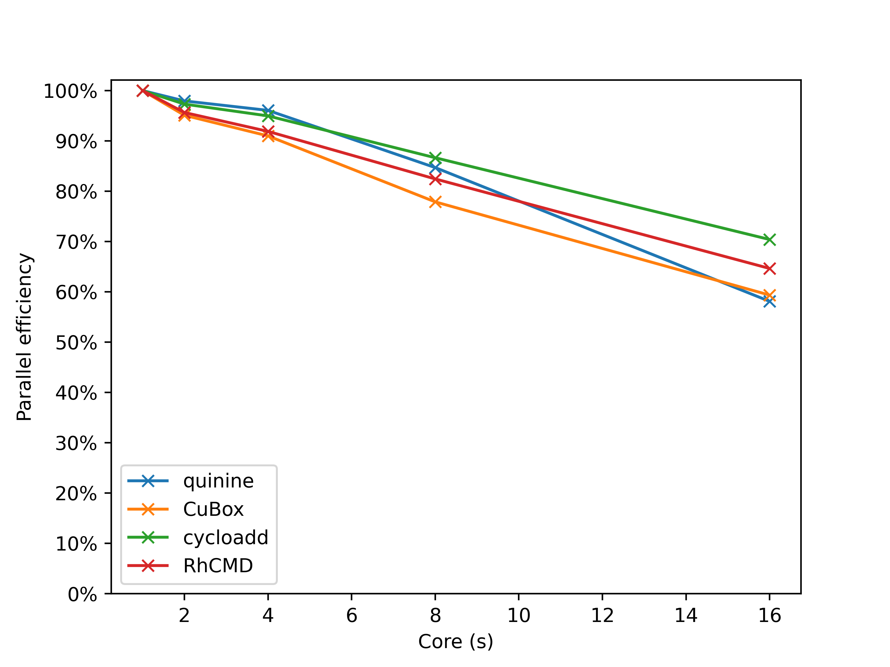
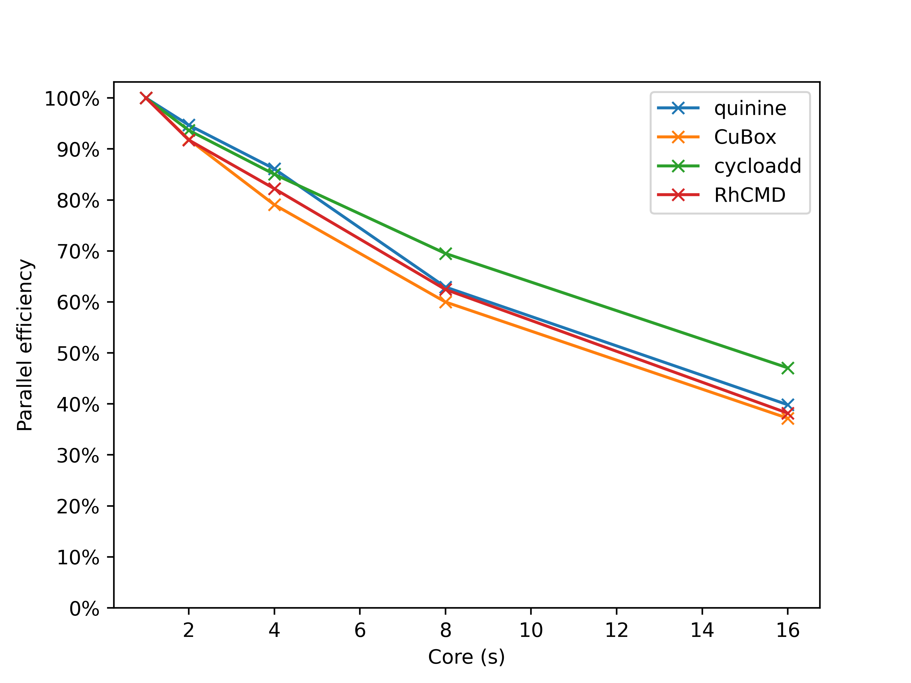
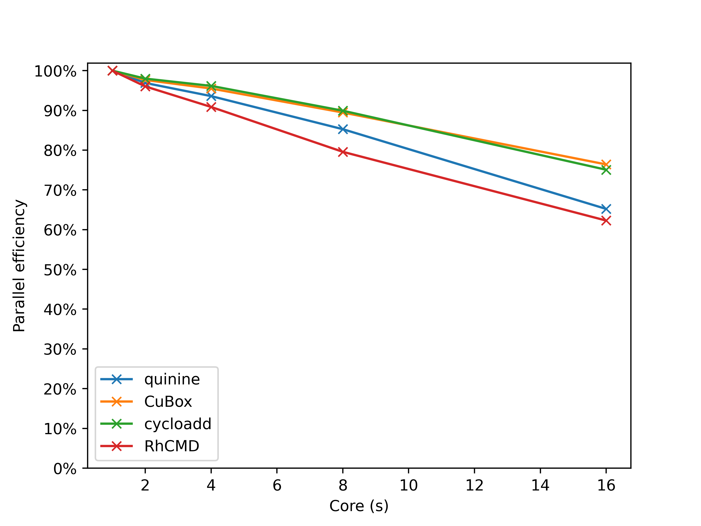

# Benchmark the Performance of DFT Calculations in PySCF

---
**Author**: Mio Touyama (東山未央)

**Date**: First release 2025-Jan-31 | Last update 2025-Jan-31
---

PySCF is a free and open-source quantum chemistry software package distributed under the Apache 2.0 license. Benefiting from its Python-C/C++ hybrid architecture and efficient code, PySCF is both fast and extensible, making it increasingly popular within the community. Density functional theory (DFT) calculations are fundamental in computational chemistry. Moreover, it can be accelerated with GPU via the GPU4PySCF plugin. Benchmarking DFT is essential not only for guidig users but might also for helping developers test their code. This article is the first in a benchmark series of various tasks, covering installation, model selection, and performance analysis.

## Installation

The current section focuses on fairly new AMD CPUs. Anaconda is used to create new environments to accommodate PySCF, which depends on either the Intel MKL or OpenBLAS mathematical libraries. Two options for CMake are enabled to enhance performance. Managing dependencies via conda eliminates the need to manually configure environment settings such as GCC and MKL.

Hardware specifications: 
- (1) PC: AMD Ryzen 9 7950X + MAG B650M MORTAR + Kingston FURY 32G ×2 DDR5 6000,
- (2) Server: AMD EPYC 9654 + Giga MZ33-AR0 + SK Hynix 32G x12 DDR5 4800
- (3) PC (1) + **GPU** (Please **donate** the author to purchase GPU and perform this test)

### MKL version

First, reate and activate the conda environment env_pscfmkl, then install compilers and dependencies including GCC and libgomp etc.  Next, install Intel MKL from channel conda-forge. The obtained GCC and MKL versions are 13.3.0 and 2024.2.2 (2024 Dec.), respectively. By tying 'which gcc', one can verify it comes from current conda environment. Skipping the compiler installation may lead to unexpected errors. Subsequent command installs numpy 2.1.3, scipy 1.14 and h5py 3.12.1, etc (2024 Dec.). Note that the compilers and MKL are unavailable in other channels, and Python packages outside conda-forge may not be the latest versions. At this stage, preparation of compilers and dependencies has been finished. To accelerate the compilation of PySCF, add -j options. To optimize the code generataion for the specific CPU architecture, add environment variable for cmake configuration. To use libqcint for better performance of one/two-electron integrals, turn on USE_QCINT for X86 platform. Then clone PySCF via git and install via pip, and the version is 2.7.0 (2024 Dec.). Previous cmake configuration is automatically applied. One can check the CMakeCache.txt or use ldd to inspect the linked libraries. Finally, install the pyscf-dispersion package to do dispersion correction.

```sh
conda create -n env_pyscfmkl && conda activate env_pyscfmkl
conda install -c conda-forge compilers
conda install -c conda-forge blas=*=*mkl libblas=*=*mkl #  OpenBlas version changes this line, see below
conda install -c conda-forge numpy scipy h5py pybind11
export MAKEFLAGS="-j16" # modify according to the cores of your CPU
export CMAKE_CONFIGURE_ARGS="-DBUILD_MARCH_NATIVE=ON -DUSE_QCINT=ON"
pip install git+https://github.com/pyscf/pyscf
pip install pyscf-dispersion
```

The Chinese mainland users can use proxy to speed up the download of libqcint, libxc, and xcfun from GitHub by prepending a proxy URL, such as https://ghproxy.cn/. Here, clone the repository at first, then manually edit the cmake configuration, and install local package by pip.

```sh
git clone https://github.com/pyscf/pyscf.git
cd pyscf/pyscf/lib
vi CMakeLists.txt
```

> set(LIBCINT_GIT https://www.ghproxy.cn/https://github.com/sunqm/libcint.git)

> set(LIBCINT_GIT https://www.ghproxy.cn/https://github.com/sunqm/qcint.git)

> GIT_REPOSITORY https://www.ghproxy.cn/https://github.com/dftlibs/xcfun.git

```sh
cd ../../../
pip install ./pyscf
```

A fake intel trick can be used to enhance the performance of Intel MKL on AMD CPUs, see 
https://danieldk.eu/Intel-MKL-on-AMD-Zen. Create and write a file named as fakeintel.c, then compile it to get libfakeintel.so. Move it to the library of current conda environment and preload it using LD_PRELOAD. 

> int mkl_serv_intel_cpu_true() { return 1; }

```sh
gcc -shared -fPIC -o libfakeintel.so fakeintel.c
mv libfakeintel.so $CONDA_PREFIX/lib
export LD_PRELOAD=$CONDA_PREFIX/lib/libfakeintel.so
```

Additionally, Block2 requires this preloaded library to run on AMD CPUs, see
https://block2.readthedocs.io/en/latest/developer/hints.html

### OpenBlas version

The difference between OpenBlas version and the MKL one lies in this line:

```sh
conda install -c conda-forge openblas[build=openmp*]
# conda install -c conda-forge libblas=*=*openblas blas=*=*openblas
```

The commented-out line is incorrect and will lead to problem of thread control, see https://github.com/pyscf/pyscf/issues/2533

### Binary version

The binary version (2.7.0, 2.8.0) installed by the following command has the problem of thread control. **Please wait for a fix**.

```sh
pip install --prefer-binary pyscf
```

### CPU usage

Correct thread control, as reflected in CPU usage, is a prerequisite for benchmarking to accurately compare parallel efficiency. For example, if 4 cores are given, the cpu usage should be lower than 400%. The MKL and OpenBLAS versions have passed this test. Note that MKL version on Hardware (2) EPYC 9654 needs '**export MKL_NUM_THREADS=4 # or 16 etc.**', probably caused by contaminated environment variables.

## Models

Four medium-sized models (36 to 52 atoms) are selected for benchmarking DFT, covering catalysts and transition states of common organic and organometallic reactions. Empowered by density fitting (RI) technique, geometry optimization with the triple-zeta basis sets takes only slightly more time than the double-zeta ones. Beyond single-point energy (SP) and the analytical gradient, PySCF supports analytical Hessians for common functionals using RIJK, but the RIJCOSX (SGX module) is only applicable to SP (version 2.7.0). Comparatively, RIJK of ORCA (6.0.1) supports a mature RIJCOSX implementation but lacks the analytical Hessian for RIJK. Thus, benchmarking the RIJK capabilities of PySCF remains valuable, even though the molecular size is limited to fewer than 60 atoms.

- Quinine, a common drug and organic catalyst scaffold
- Bis(oxazoline) copper, a common organometallic catalyst, abbr. CuBox
- The transition state of 1,3-dipolar cycloaddition, abbr. cycloadd
- The transition state of rhodium catalyzed C-H activation via concerted metallation-deprotonation, abbr. RhCMD



| Model | Atoms | Basis Functions | XC Functional | Grid | Int. screening | Note |
| - | - | - |  - | - | - | - |
| quinine | 48 | 888 | ωB97M-V | superfine (99,590) | 1e-12 | [a] |
| CuBox | 36 | 692 | B3LYP-D3(BJ) | fine (75,302) | 1e-10 | Open-shell |
| cycloadd | 40 | 715 | M06-2X-D3 | superfine (99,590) | 1e-12 | TS, [b] |
| RhCMD | 52 |971 | B3LYP-D3(BJ) | fine (75,302) | 1e-10 | TS |

Table 1 | Model info and thoeretical level, basis sets are def2-TZVP.
[a] with VV10 nonlocal correlation. Use another grid SG1 (50,194) for nlc. Analytical Hessian is not available.
[b] Angew. Chem. Int. Ed. 2020, 59, 12412. https://doi.org/10.1002/anie.202005265

To ensure a comprehensive test, hybrid functionals spanning GGA, meta-GGA and the range-separated meta-GGA are selected, specifically, B3LYP-D3(BJ), M06-2X-D3, and ωB97M-V. Among the models, one is open-shell, while another employs a pseudo-potential along with its corresponding basis set.

| Model\Cores | SCF + Grad 1 core | SCF + Grad 4 cores |
| - | - | - |
| CuBox | 23.8% | 36.1% |
| cycloadd | 88.0% | 64.8% |

Table 2 | Additional computational cost of RIJK DFT/def2-TZVP compared to def2-SVP on 7950X.

## Parallel Efficiency

The benchmark data of Hardware (1) 7950X is provided, while (2) is running. When a task is running, such as RhCMD with 4 cores, no other tasks are allowed, even if not all cores are fully utilized. For SCF and gradient tasks, the number of cores follows a geometric sequence: 1, 2, 4, 8, 16, whereas for the Hessian task, it follows an arithmetic sequence: 4, 8, 12, 16. All listed time costs are wall clock time averaged over 3 replicas. The parallel efficiency of ORCA is also tested using the same model but with RIJCOSX, different convergence criterion and defgridx grid.

### SCF

The parallel efficiency of PySCF rapidly decreases as the number of cores increases. At 16 cores, it drops to ~50%, and the ωB97M-V functional drops quickly to 60% efficiency at 4 cores even if the cycles of SCF iteration are identical. In comparison, ORCA maintains ~70% efficiency even at 16 cores.



| Model\Cores | 1 | 2 | 4 | 8 | 16 |
| - | - | - | - | - | - |
| quinine | 2282.8 | 1212.5 | 667.1 | 405.4 | 298.0
| CuBox | 674.8 | 356.7 | 196.6 | 123.7 | 97.8
| cycloadd |1032.6 | 547.4 | 432.9 | 377.7 | 363.2
| RhCMD |1571.6 | 841.1 | 472.2 | 297.5 | 241.5

Table 3-1 | Computational cost (s) of SCF on 7950X.



### Gradient

For gradient tasks, the parallel efficiency of PySCF still declines rapidly, dropping to only ~40% at 16 cores, while ORCA maintains an efficiency of over 70%.



| Model\Cores | 1 | 2 | 4 | 8 | 16 |
| - | - | - | - | - | - |
| quinine | 825.2 | 435.7 | 239.6 | 163.9 | 129.5
| CuBox | 206.3 | 112.3 | 65.2 | 43.0 | 34.7
| cycloadd | 310.1 | 165.6 | 91.2 | 55.8 | 41.2
| RhCMD | 387.5 | 211.2 | 117.8 | 77.6 | 63.4

Table 4-1 | Computational cost (s) of gradient on 7950X.



### Hessian (Ongoing)

| Model\Cores | 4 | 8 | 12 | 16 |
| - | - | - | - | - |
| CuBox | | | | |
| cycloadd | | | | |

Table 5-1 | Computational cost (s) of Hessian on 7950X.

## Impact of Compilation Method

The fake intel tricked MKL version of PySCF is the fastest following the order of fake intel MKL > OpenBlas > MKL. The original MKL version takes 1% to 14% more time, while the OpenBlas version requires up to 6% additional time. The compilation method has a minimal impact on execution time.

| Model\Task | SCF 1 core | SCF 4 cores | Grad 1 core | Grad 4 cores |
| - | - | - | - | - |
| quinine | 1.1% | 1.0% | 4.6% | 5.0%
| CuBox | 13.3% | 13.7% | 10.1% | 10.9%
| cycloadd | 5.0% | 3.9% | 8.2% | 9.9%
| RhCMD | 7.9% | 6.4% | 6.9% | 7.5%

Table 5-1 | Additional computational cost of the MKL version compared to the fake intel tricked one on 7950X.

| Model\Task | SCF 1 core | SCF 4 cores | Grad 1 core | Grad 4 cores |
| - | - | - | - | - |
| quinine | 1.4% | 0.4% | 4.6% | 2.4%
| CuBox | 6.2% | 4.9% | 3.6% | 1.5%
| cycloadd | 0.4% | 1.6% | 2.2% | 1.2%
| RhCMD | 2.2% | 1.0% | 3.8% | 1.1%

Table 6-1 | Additional computational cost of the OpenBlas version compared to the fake intel tricked one on 7950X.

### Reproducibility

The maximum standard deviation (std) of energies among 4 models is 6e-13 Ha. The maximum std of rms force among 4 models is 4e-10 Ha/Bohr.

## Conclusion

The parallel efficiency of DFT in PySCF is lower than that of ORCA, so using fewer cores is recommended. The fake intel tricked MKL version of PySCF is slightly faster than OpenBlas one.

## Acknowledgement
Thanks to Aires, Paramecium and Scarlet for their help.
